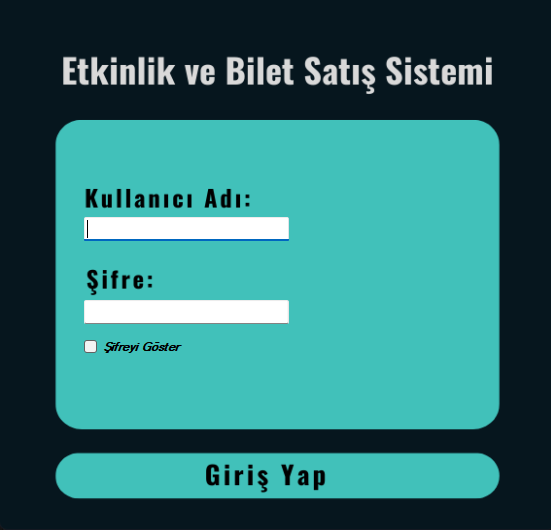
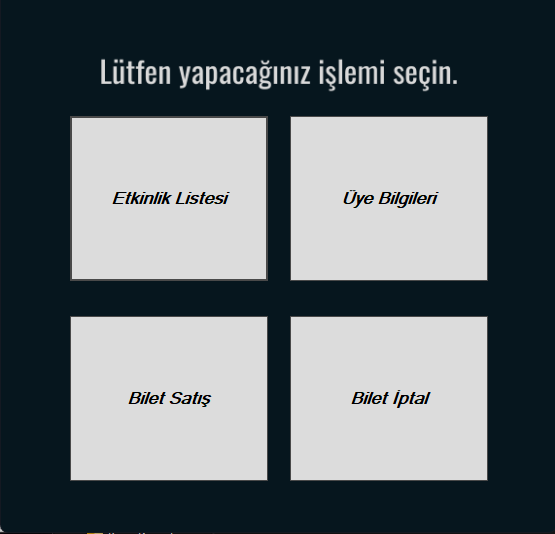
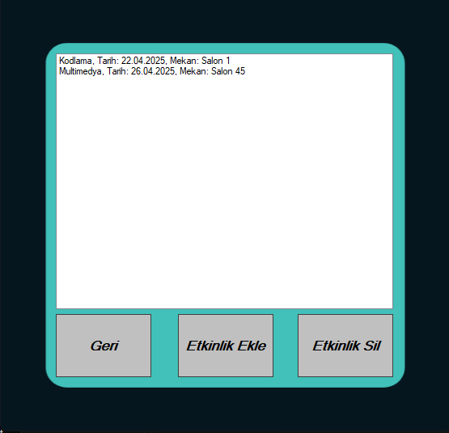
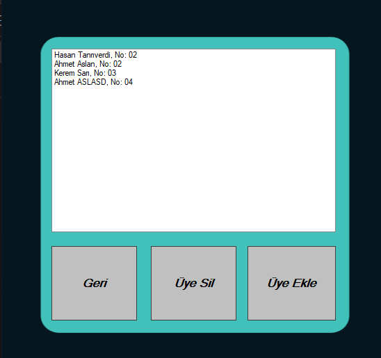
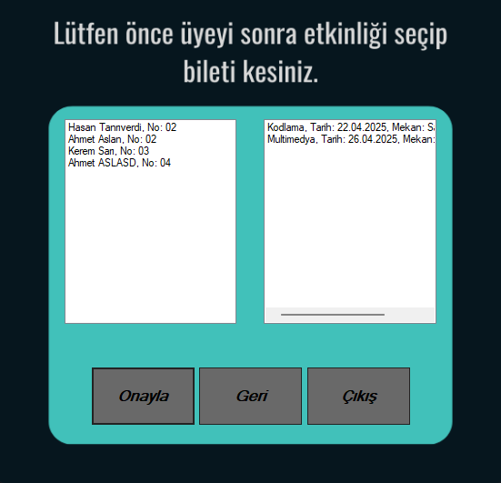
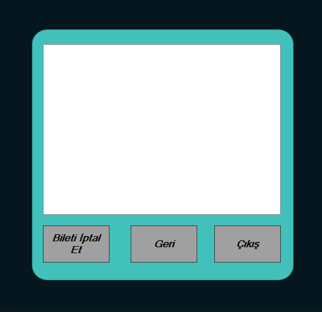

# 🎟️ Etkinlik ve Bilet Satış Sistemi

Bu proje, **C# Windows Forms** kullanılarak geliştirilmiş bir **Etkinlik ve Bilet Satış Sistemi** uygulamasıdır. Kullanıcılar, etkinlikleri görüntüleyebilir, etkinlik detaylarını inceleyebilir, koltuk seçimi yaparak bilet satın alabilir ve bilet bilgilerini görüntüleyebilir. Proje eğitim amaçlıdır.

## 🧩 Özellikler

- Etkinlikleri listeleme
- Etkinlik detaylarını görüntüleme
- Koltuk seçimi yaparak bilet satın alma
- Satın alınan bilet bilgilerini görüntüleme
- Basit ve kullanıcı dostu arayüz

## 🛠️ Kullanılan Teknolojiler

- C# (Windows Forms)
- .NET Framework
- Visual Studio
- (Opsiyonel: JSON, XML ya da SQL Server ile veri saklama)

## 🖼️ Uygulama İçi Ekran Görüntüleri

  
  
  
  
  

